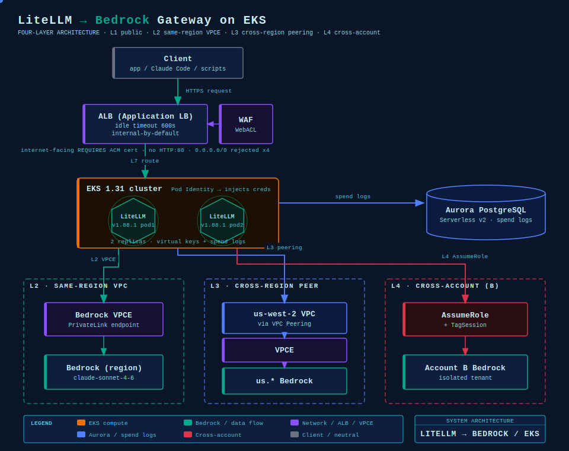
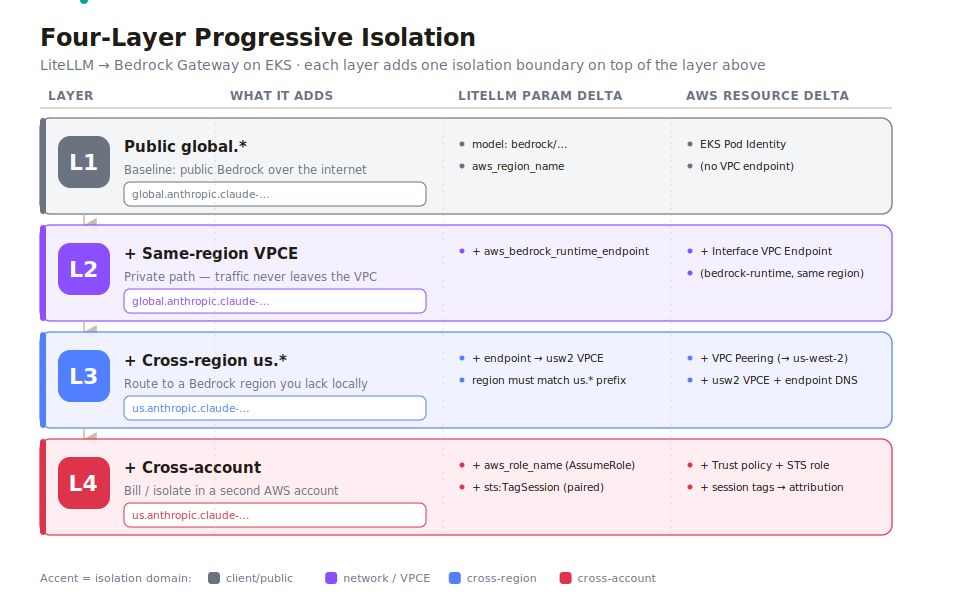
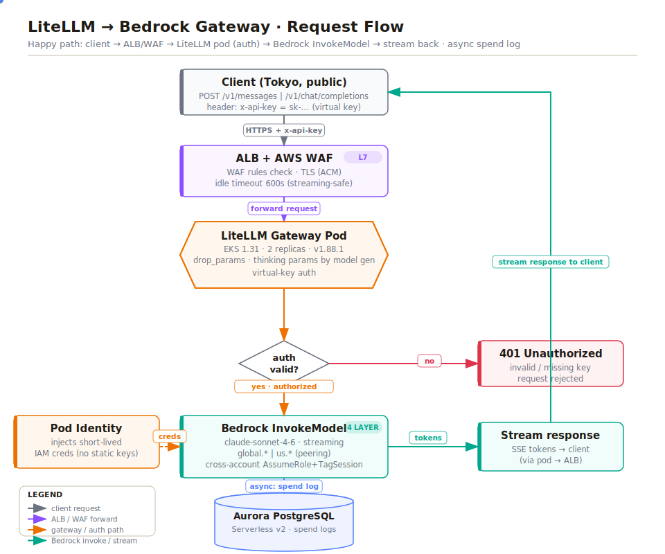
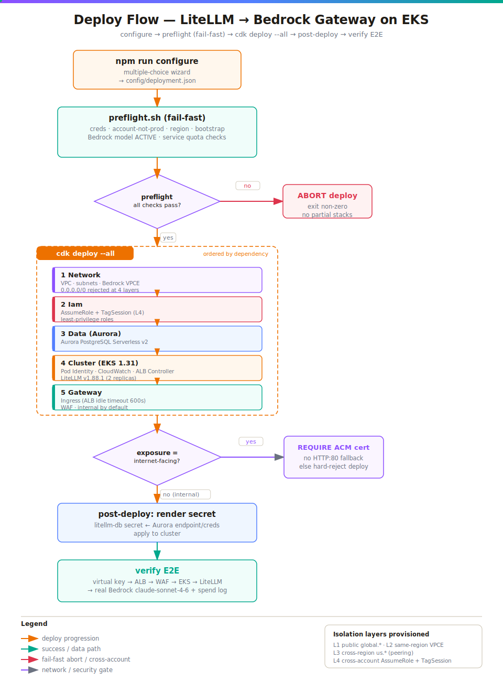
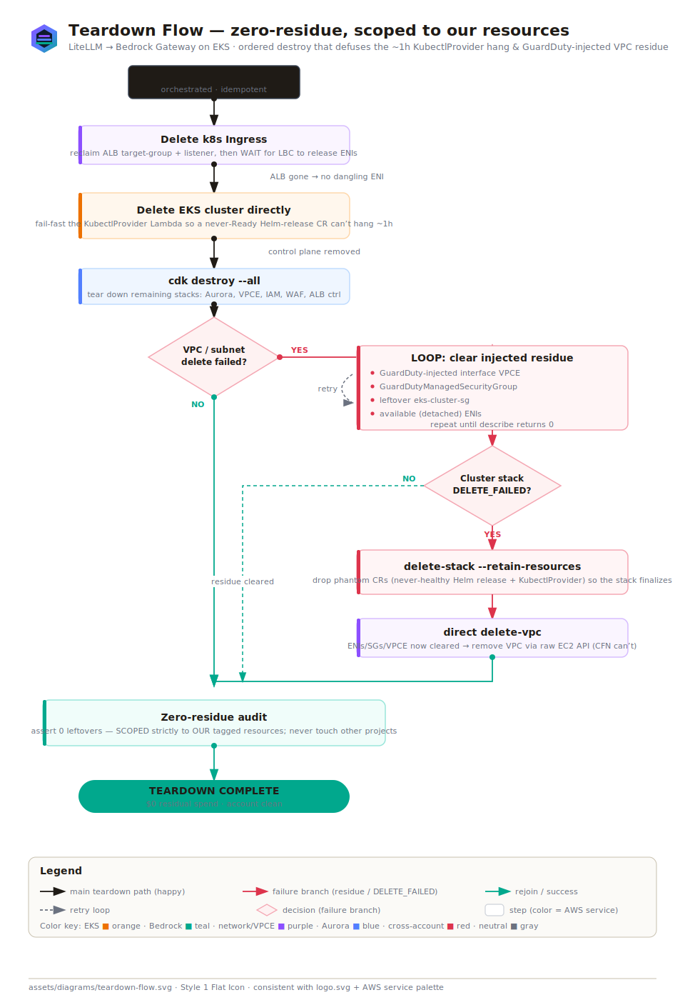

English | [中文](README.zh-CN.md)

<div align="center">
  
</div>

<p align="center">
  
  
  
  
  
</p>

# LiteLLM → Bedrock: a production-grade model gateway on EKS

Customers want a single, OpenAI-/Anthropic-compatible entry point in front of Amazon Bedrock — one place to manage keys, cost and rate limits — without every application wrestling with each vendor's SDK differences. **LiteLLM Proxy** sits exactly in that seam between the client and Bedrock. The hard part isn't installing LiteLLM; it's that as a customer's requirements for **network isolation** and **account boundaries** tighten, the model configuration has to be layered up to match. This repo distills that "four progressive layers" journey into reproducible **AWS CDK (TypeScript)** code — wherever the customer needs to land, `npm run configure` configures exactly that far and no further.

> This repo is the **AWS CDK implementation** of [this article](https://www.genai-playbook.com/articles/litellm-bedrock-gateway.html). The full narrative (architecture rationale, the story behind each trade-off) lives at the source; this README is the implementation guide, and the code is the source of truth (LiteLLM `v1.88.1`, EKS `1.31`). All account IDs, VPC Endpoints, domains and keys in this repo are placeholders (`<ACCOUNT_B>`, `vpce-xxxxx`) and contain nothing that can locate a real resource.

---

## Table of contents

- [What LiteLLM Proxy solves](#what-litellm-proxy-solves)
- [Architecture](#architecture)
- [The four progressive layers](#the-four-progressive-layers)
- [Request flow](#request-flow)
- [Deployment as a set of multiple-choice questions](#deployment-as-a-set-of-multiple-choice-questions)
- [L1 security design (three modes)](#l1-security-design-three-modes)
- [L4 same-account simulation of cross-account](#l4-same-account-simulation-of-cross-account)
- [Timeout alignment — ALB idle must go from 60s to 600s](#timeout-alignment--alb-idle-must-go-from-60s-to-600s)
- [Claude Code client setup](#claude-code-client-setup)
- [API key management (LiteLLM native)](#api-key-management-litellm-native)
- [Thinking parameters by model generation](#thinking-parameters-by-model-generation)
- [Cost & observability](#cost--observability)
- [Testing matrix](#testing-matrix)
- [Real-deployment verification record](#real-deployment-verification-record)
- [Real-deployment gotchas & fixes](#real-deployment-gotchas--fixes-not-catchable-by-local-synth)
- [Teardown](#teardown)
- [Pre-production checklist](#pre-production-checklist)
- [Cost & safety notes](#cost--safety-notes)
- [Project structure](#project-structure)
- [Troubleshooting](#troubleshooting)
- [License](#license)

---

## What LiteLLM Proxy solves

Many people think of LiteLLM as an SDK you import to call models. It does have an SDK form, but this architecture uses its other face: the **Proxy Server** — a standalone service process that exposes two standard HTTP interfaces to the outside, `/v1/chat/completions` (OpenAI format) and `/v1/messages` (Anthropic format), and internally translates requests into each vendor's calls. Placing it between the client and Bedrock solves four very concrete problems:

| # | Value | What it means |
|---|-------|---------------|
| 01 | **Unified entry point** | Applications, Claude Code and scripts all point at the same endpoint and authenticate with the same key. Swapping models, adding models, or changing routing only touches gateway config — clients don't change a single line. |
| 02 | **Credential containment** | Bedrock IAM credentials and cross-account AssumeRole are all locked inside the gateway Pod. Clients only ever hold a LiteLLM-issued virtual key and never see AWS credentials; revoking a customer is just deleting one virtual key. |
| 03 | **Cost visibility** | LiteLLM's built-in spend log records, per request, which model was used, how many tokens, and the dollar cost, persisted to the database. Who spends the most and which model costs the most become obvious. |
| 04 | **Smoothing over differences** | Claude on Bedrock has call formats, thinking parameters and various beta headers that don't fully match the native Anthropic API. The gateway smooths these over internally so clients can send the standard format. |

---

## Architecture

The diagram below shows the system with **all four layers stacked**. A request enters from the client, passes through the ALB to a LiteLLM Pod on EKS, and the Pod then egresses to Bedrock over one of three paths depending on the model, while account state persists in Aurora.

<div align="center">
  
</div>

A few design trade-offs worth calling out:

- **EKS instead of a single EC2** — the core reason is high availability: if the production gateway goes down, every customer loses access at once, which is unacceptable. Two replicas with rolling updates mean zero-downtime LiteLLM version upgrades.
- **ALB with IP-restricted ingress** — behind it are billed Bedrock calls. Opening the security group to `0.0.0.0/0` exposes a high-cost entry point to the internet; if a virtual key leaks, anyone can drive calls. Only allow known customer IPs — a hard red line that this repo validates at CDK synth time (see [L1 security design](#l1-security-design-three-modes)).
- **ALB, not CloudFront** — see [Timeout alignment](#timeout-alignment--alb-idle-must-go-from-60s-to-600s).
- **Pod Identity instead of IRSA** — simpler configuration, and it natively supports transitive session tagging, which the fourth (cross-account) layer relies on.
- **Aurora PostgreSQL Serverless v2** — backs `store_model_in_db` and the spend log so both Pods share one record set and it autoscales with load.
- **Deliberately small Pod sizing** (250m CPU / 1Gi, capped at 500m / 2Gi) — LiteLLM is IO-bound; the bottleneck is network and concurrent connections, not CPU. `securityContext` is tightened to least privilege.

---

## The four progressive layers

The four layers are **orthogonal and stackable** (`LayerFlags` in `config/schema.ts`) — a customer configures exactly as far as they need. L1 is the foundation and is always `true`.

<div align="center">
  
</div>

### L1 · Public entry point (simplest)

**What it adds:** a Pod with internet egress that calls the Bedrock public endpoint directly.
**LiteLLM params:** `model` + `aws_region_name` + `drop_params`. Credentials are injected automatically by EKS Pod Identity — no access keys are written anywhere.
**AWS resources:** EKS + ALB + Pod Role (this repo's `NetworkStack` / `ClusterStack` / `IamStack`).
**Key gotchas:** `drop_params: true` discards OpenAI parameters Bedrock doesn't recognize, avoiding 400s; `global.*` is a cross-region inference profile and **must be called via an Inference Profile**, not as a bare base model ID.

```yaml
model_list:
  - model_name: claude-sonnet-4-6
    litellm_params:
      model: bedrock/global.anthropic.claude-sonnet-4-6
      aws_region_name: ap-northeast-1
      drop_params: true
```

### L2 · Same-region VPCE (+ private network)

**What it adds:** a Bedrock **VPC Endpoint (VPCE)** in the Pod's own region. The Pod has no internet access at all; traffic stays on the AWS private network end to end.
**LiteLLM params:** one extra line, `aws_bedrock_runtime_endpoint`, pointing at that VPCE.
**AWS resources:** a `com.amazonaws.<region>.bedrock-runtime` interface endpoint (Private DNS on); a VPCE security group that allows 443 inbound from the Pod subnets; Pod subnets with the public route removed.
**Key gotchas:** with the VPCE in the same VPC as the Pod, Private DNS makes even the default hostname resolve correctly; writing the VPCE hostname explicitly in config mainly makes the traffic path obvious and lays groundwork for L3's cross-VPC case.

```yaml
  - model_name: claude-sonnet-4-6
    litellm_params:
      model: bedrock/global.anthropic.claude-sonnet-4-6
      aws_region_name: ap-northeast-1
      aws_bedrock_runtime_endpoint: https://vpce-xxxxx.bedrock-runtime.ap-northeast-1.vpce.amazonaws.com
      drop_params: true
```

### L3 · Cross-region US Inference Profile (+ cross-region private network)

**What it adds:** pins the inference entry to US regions using a **US Inference Profile** (`us.*` prefix), while staying private end to end. The mechanism is a **cross-region VPC Peering** between the workload VPC (say, Tokyo) and a us-west-2 VPC, with a Bedrock VPCE on the us-west-2 side; traffic crosses the peering privately.
**LiteLLM params:** `model: bedrock/us.anthropic.*` + `aws_region_name: us-west-2` + an `aws_bedrock_runtime_endpoint` pointing at the us-west-2 VPCE.
**AWS resources:** cross-region VPC Peering, a Bedrock VPCE on the us-west-2 side, route tables and security groups on both sides.
**Key gotchas (three things must be right):**
1. **The endpoint must be the VPCE-specific hostname** (starting with `vpce-`). Private DNS only works inside the VPC that created the endpoint and does not propagate across peering; writing the default hostname resolves to a public IP and skips the VPCE.
2. **`aws_region_name` must match the VPCE's region** (`us-west-2`), otherwise the SDK request signature won't line up and signing fails.
3. **Both route tables need a peering route to the peer CIDR**; the us-west-2 VPCE security group must allow 443 inbound from the Tokyo VPC CIDR.

> Latency: trans-Pacific peering adds roughly 100–150ms over a same-region VPCE (mostly at first token). You can configure `us.*` as a fallback for `global.*`.

```yaml
  - model_name: claude-opus-4-8-us
    litellm_params:
      model: bedrock/us.anthropic.claude-opus-4-8
      aws_region_name: us-west-2
      aws_bedrock_runtime_endpoint: https://vpce-usw2-xxxxx.bedrock-runtime.us-west-2.vpce.amazonaws.com
      drop_params: true
```

### L4 · Cross-account unified management (+ cross-account)

**What it adds:** multiple AWS accounts all use Bedrock, but a single gateway issues keys and does accounting uniformly. The mechanism is **cross-account AssumeRole**: the Pod first assumes a role in the target account, then uses the temporary credentials to call that account's Bedrock. Each account is billed separately.
**LiteLLM params:** `aws_role_name` (the target account's cross-account role ARN) + `aws_session_name`.
**AWS resources:** the workload account's Pod Role gets `sts:AssumeRole` (trusting `pods.eks.amazonaws.com`); the target account's cross-account role trusts the workload Pod Role and is granted Bedrock permissions. Optional: a same-region STS VPCE (if AssumeRole must also stay private).
**Key gotchas:** **both policies must carry `sts:TagSession`, paired with `sts:AssumeRole`.** Pod Identity attaches a transitive session tag when it injects credentials, and that tag is passed along on AssumeRole; if the target account's trust policy only allows `sts:AssumeRole` without `sts:TagSession`, you get an immediate AccessDenied (the classic gotcha this repo deliberately reproduces).

```yaml
  - model_name: claude-sonnet-4-6-acct-b
    litellm_params:
      model: bedrock/global.anthropic.claude-sonnet-4-6
      aws_region_name: ap-northeast-1
      aws_role_name: arn:aws:iam::<ACCOUNT_B>:role/LiteLLM-Bedrock-CrossAccount-Role
      aws_session_name: bedrock-session
      aws_bedrock_runtime_endpoint: https://vpce-xxxxx.bedrock-runtime.ap-northeast-1.vpce.amazonaws.com
      drop_params: true
```

### Two special model-ID forms

| Form | Used for | Key point |
|------|----------|-----------|
| **Bare ID** (no `global.`/`us.` prefix, via `bedrock/converse/`) | Open-weight models on Bedrock (GLM, Kimi, etc.) | They **do not support** cross-region inference profiles and conversely **must** be called with a bare model ID via `bedrock/converse/`. The Pod's IAM policy must add a foundation-model ARN for each of these models individually — the wildcard ARN for the Claude family won't cover them. |
| **AIP** (Application Inference Profile) | Fine-grained cost attribution (e.g. AWS MAP credit offset) | Tags calls for traceability; local credentials suffice. Limitation: an AIP can only wrap a base model that actually exists in a given region, and **cannot** wrap a `global.*` cross-region profile. |

### A few global settings worth reusing

```yaml
litellm_settings:
  drop_params: true        # discard params Bedrock doesn't accept, avoiding 400s
  request_timeout: 600     # leave room for long inference
  num_retries: 2           # auto-retry transient failures
  fallbacks:               # model-level degradation chain: switch on failure
    - claude-opus-4-6: [claude-opus-4-5, claude-sonnet-4-5]
    - claude-sonnet-4-6: [claude-sonnet-4-5]
  context_window_fallbacks: # switch to a larger-window variant on overflow
    - claude-sonnet-4-5: [claude-4-5-sonnet-1M]

general_settings:
  store_model_in_db: true
  store_prompts_in_spend_logs: true
```

`fallbacks` handles call failures (rate limits, errors → try an alternate), while `context_window_fallbacks` handles context overflow (e.g. from a 200K Sonnet to a 1M Sonnet). They are two different things.

---

## Request flow

The end-to-end path of a single request through the gateway — from the client's virtual key at the ALB, through LiteLLM's authentication, routing and translation, to Bedrock and back — with the spend log written along the way.

<div align="center">
  
</div>

---

## Deployment as a set of multiple-choice questions

Deployment is two steps: `npm run configure` interactively answers a set of multiple-choice questions and writes them to `config/deployment.json` (the "answer sheet"); then `cdk deploy`. `bin/app.ts` reads that answer sheet and **only instantiates the stacks the selected layers require** — the configuration decides what gets synthesized.

<div align="center">
  
</div>

```bash
npm install
npm run configure          # answer questions → config/deployment.json
npx cdk deploy --all       # synth & deploy per the answer sheet
# cleanup:
npx cdk destroy --all
```

The questions `configure` asks (mapping to `DeploymentConfig` in `config/schema.ts`):

| Question | Field | Default / values |
|----------|-------|------------------|
| Stack name prefix | `prefix` | `LiteLLMGateway` (starts with a letter; alphanumeric + hyphen) |
| Primary region (EKS + workload VPC) | `primaryRegion` | `ap-northeast-1` |
| L3's second region (`us.*` profile) | `usProfileRegion` | `us-west-2` (must differ from `primaryRegion`) |
| Which layers to deploy | `layers.l1..l4` | L1 always `true`; POC defaults to L1+L2 |
| ALB exposure mode | `alb.exposure` | `internal` / `allowlist-explicit` / `allowlist-exclude` (POC defaults to the last) |
| Allowed / excluded CIDRs | `alb.allowedCidrs` / `alb.excludedIps` | depends on exposure |
| Enable WAF + rate limit | `alb.enableWaf` / `alb.wafRateLimit` | on by default in exclude mode, `2000`/5min/IP |
| L4 account mode | `l4.mode` | `same-account-simulated` (default) / `real-cross-account` |
| End-to-end timeout | `timeoutSeconds` | `600` (range 60..4000, `<600` warns) |
| Versions | `versions.eks` / `versions.litellm` | `1.31` / `v1.88.1` |

> `npm run detect-ip` probes this machine's public IP, handy for filling in the CIDR for `allowlist-explicit`.

### Preflight

Before `make deploy`, confirm the following to avoid most "found out halfway through deployment" rework:

```bash
# toolchain
node -v            # >= 18
aws --version
kubectl version --client
cdk --version      # aligned with aws-cdk in package.json (2.1126.0)

# identity & region (must be a non-production account!)
aws sts get-caller-identity
echo "$AWS_REGION / $CDK_DEFAULT_REGION"

# code must compile, test and synth clean (default config AND the L3-enabled config)
npx tsc --noEmit
npx jest
npm run synth

# CDK bootstrap (once per account+region)
cdk bootstrap aws://<ACCOUNT_ID>/$REGION

# Bedrock model access: confirm the target region has access to the models
aws bedrock list-foundation-models --region "$REGION" \
  --query "modelSummaries[?contains(modelId,'claude')].modelId" --output table
```

---

## L1 security design (three modes)

The ALB's exposure mode is the most important security decision in this repo. The company red line is **never write `0.0.0.0/0`**. Three compliant ways:

| Mode | Network | Description | Security level |
|------|---------|-------------|----------------|
| `internal` | ALB has no public IP | **Zero exposure surface**, most secure. No CIDR needed. | ★★★ |
| `allowlist-explicit` | internet-facing | Only allows **explicitly listed CIDRs** (known customer IPs). **The article's red line, strictest, recommended default for customers.** Fail-closed: not filling in a single CIDR rejects synthesis. | ★★ |
| `allowlist-exclude` | internet-facing | Allows the vast majority, blocks only a few IPs. **POC default.** | ★ (POC only) |

### The technical core of `allowlist-exclude`: the CIDR complement

Security groups have only ALLOW rules and **cannot express DENY**. To achieve "allow almost everyone, block only a few IPs" without writing `0.0.0.0/0`, this repo (`complementOf` in `lib/cidr.ts`) computes the **CIDR complement** of the blocked IPs: a set of prefixes whose union equals the full IPv4 space minus the blocked addresses.

- Excluding **one `/32`** produces exactly **32 CIDRs** (one sibling block at each prefix length 32..1), covering **2³²−1** addresses — all but that one IP.
- The result contains **no literal `0.0.0.0/0`**, so compliance scanners (AWS Config / Security Hub, which only match the literal `0.0.0.0/0`) stay green.
- The actual blocking and rate limiting are handed off to **WAF** (managed rules + rate limit) — the architecturally correct home for a denylist.

> **Honest labeling:** functionally this mode is roughly "publicly reachable + WAF denylist"; its **security level is below `explicit` and it is POC-only**. If `excludedIps` is empty but this mode is selected, it degrades to two `/1` half-space CIDRs (functionally open, but still no literal `/0`, and WAF/rate limit still apply) and is loudly warned about.

`lib/cidr.ts` also provides `coverageFraction(n)`, which can generate prefixes covering `(2ⁿ−1)/2ⁿ` (1/2, 3/4, 7/8, 31/32…), all of which **never emit `0.0.0.0/0`**.

### CDK-level hard validation (`assertNotWorldOpen`): fail-closed by default, informed-consent to allow

- **Fail-closed by default:** any `0.0.0.0/0` / `::/0` (including semantic `/0` and all-zeros expansions) makes **synth `throw ConfigValidationError`** by default. Our own POC never opens this door, so non-production accounts are protected out of the box.
- But this is a **template for customers to reuse** — the ownership boundary belongs to the deployer. If a customer genuinely needs a wider inbound range in their own scenario, they can explicitly set `alb.acknowledgeOpenInternet: true` in config (the "I know what I'm doing" informed-consent switch); only then is `0.0.0.0/0` allowed, and each time a loud warning prints: this exposes a **billed Bedrock entry point to everyone**, anyone can use a leaked virtual key, and WAF + rate limit are strongly recommended — or switch to `explicit` / `exclude` / `internal`.
- Customers can also use `allowlist-explicit` to define **any CIDR range** (including wider blocks); we only issue a strong recommendation and warning at synth time, without forcing.
- The allowlist can also cover any `(2ⁿ−1)/2ⁿ` fraction (`coverageFraction` in `lib/cidr.ts`: 3/4, 7/8, 31/32…), or use the **complement** to precisely "exclude a few IPs, allow the rest".

```jsonc
{
  "alb": {
    "exposure": "allowlist-explicit",
    "acknowledgeOpenInternet": true   // informed consent: allow 0.0.0.0/0, synth loudly warns every time
  }
}
```

---

## L4 same-account simulation of cross-account

The POC defaults to `l4.mode = 'same-account-simulated'`: within **a single non-production account**, it builds two IAM roles (Pod Role + cross-account role), with the Pod Role's `sts:AssumeRole` + `sts:TagSession` **paired** (reproducing that classic AccessDenied gotcha), exercising the full cross-account call chain while creating **zero resources in the production account**.

When you need real cross-account, switch `mode` to `real-cross-account` and fill in `targetAccountId` (must be 12 digits and differ from `workloadAccountId`) to land the cross-account role in the real account B. The AssumeRole + TagSession call chain is **independent of whether the accounts are the same**, so the same-account two-role setup reproduces the mechanism 100% while leaving the production account untouched.

---

## Timeout alignment — ALB idle must go from 60s to 600s

This is the single most common thing to trip over in production. LiteLLM has its own `request_timeout`, but what actually cuts the conversation off first is usually the load balancer in front of it. **The ALB's idle timeout defaults to just 60 seconds** — if no new data flows for 60 seconds, it drops the connection; the client sees a broken request / 504 while LiteLLM is still calmly waiting for the model to return, with no error in its logs, making it very easy to misdiagnose.

The fix: raise the timeout at every layer of the path to cover the longest request and **align them with each other**, otherwise the shortest layer always fires first.

| Layer | Setting | Default | Recommended |
|-------|---------|---------|-------------|
| ALB | `idle_timeout.timeout_seconds` (ingress annotation) | 60s | **600s** |
| Nginx (self-hosted) | `proxy_read_timeout` / `proxy_send_timeout` | 60s | **600s** |
| LiteLLM | `request_timeout` (config file) | — | **600s** |

Streaming output does not sidestep this: idle timeout counts the gap *between* two data chunks, and if the model thinks for a long time before the first token (common with extended thinking), that silence can hit the idle timeout. **The wait before the first token is what needs the most headroom.**

**Why ALB, not CloudFront:** first, CloudFront's origin response timeout defaults to 30s and caps at 120s (and that cap requires a separate quota request), which can't sustain multi-minute conversations, whereas the ALB idle timeout can go to 4000s. Second, CloudFront is for edge distribution of cacheable content, whereas the gateway's traffic is all authenticated, all-different POSTs with nothing to cache — so adding it only introduces one more hop of latency and cost.

---

## Claude Code client setup

Claude Code connects to Anthropic's official API by default. Redirecting it to your self-hosted gateway takes two key steps: point it at the gateway address, then use an `apiKeyHelper` script to feed the virtual key in.

> **Gotcha:** setting `ANTHROPIC_AUTH_TOKEN` in `env` alone often doesn't work — a static token is sent as a single `Authorization` header, but LiteLLM's virtual-key check reads `x-api-key`. The key emitted by `apiKeyHelper` is sent on **both** `Authorization` and `X-Api-Key` headers — that's what makes it work. Claude Code uses the `/v1/messages` (Anthropic format) entry point.

`~/.claude/settings.json`:

```jsonc
{
  "apiKeyHelper": "~/.claude/litellm-key.sh",
  "env": {
    "ANTHROPIC_BASE_URL":             "https://<your-LiteLLM-gateway-address>",
    "ANTHROPIC_DEFAULT_OPUS_MODEL":   "claude-opus-4-8",
    "ANTHROPIC_DEFAULT_SONNET_MODEL": "claude-sonnet-4-6",
    "ANTHROPIC_DEFAULT_HAIKU_MODEL":  "claude-haiku-4-5"
  }
}
```

`~/.claude/litellm-key.sh` (remember `chmod +x`):

```bash
#!/bin/bash
# simplest: just echo the virtual key
echo "<your-LiteLLM-virtual-key>"
```

The three `ANTHROPIC_DEFAULT_*_MODEL` values map Claude Code's built-in opus/sonnet/haiku tiers to `model_name`s in your `model_list`; the values must match **literally**, or the gateway can't find the model when switching tiers. Once configured, `/model sonnet` and `/model opus` switch instantly. When keys rotate, change the script to pull the key from a vault, then use `CLAUDE_CODE_API_KEY_HELPER_TTL_MS` to set the refresh interval. Verify the path by curling the gateway's `/v1/messages` and checking for a 200.

---

## API key management (LiteLLM native)

After setup, key management is simply **LiteLLM Proxy's full built-in system**, identical to standalone LiteLLM; our architecture (Aurora + `store_model_in_db: true`) already satisfies all prerequisites.

| Role | Mechanism | Where it lands |
|------|-----------|----------------|
| Admin | `master_key` (`sk-...`): create/delete virtual keys, access the Admin UI | injected via K8s Secret into env var `LITELLM_MASTER_KEY`, **never hardcoded** (see `master_key: os.environ/LITELLM_MASTER_KEY` in `k8s/litellm-config.yaml`) |
| Customer/tenant | Virtual key (`POST /key/generate`): can set budget, rate limit, allowed-model list | stored in Aurora; revoke = delete one key |
| Graphical management | Admin UI (`/ui`) | ships with the Proxy |
| Teams/budgets | Teams / Budgets / spend attribution | depends on `store_model_in_db: true` (configured) |

Clients only ever hold a virtual key and **never see the underlying AWS/Bedrock credentials** — the concrete realization of the "credential containment" value.

Generate a virtual key with the master key (`$LITELLM_MASTER_KEY` comes from the environment variable — never hardcode a real key):

```bash
curl -X POST https://<gateway-address>/key/generate \
  -H "Authorization: Bearer $LITELLM_MASTER_KEY" \
  -H "Content-Type: application/json" \
  -d '{"models":["claude-sonnet-4-6"],"max_budget":50}'
```

---

## Thinking parameters by model generation

Claude's extended thinking on Bedrock uses a parameter format that varies by model generation; getting it wrong produces "looks like thinking is on but it isn't thinking".

| Form | Opus 4.7 / 4.8 | Opus 4.6 / Sonnet 4.6 | Notes |
|------|:---:|:---:|-------|
| `thinking.type: adaptive` | ✅ recommended | ✅ | The model decides how much to think based on task complexity |
| `output_config.effort` | ✅ | ✅ | `low/medium/high/xhigh/max`; must be in `output_config`, not inside `thinking`, or you get a ValidationException. `xhigh` is 4.7/4.8-only and GA |
| `thinking.type: enabled` + `budget_tokens` | ❌ deprecated | still usable | `budget_tokens` is deprecated; for 4.7/4.8 switch to `adaptive` |

> **Version gotcha:** on older LiteLLM, sending Opus 4.7/4.8 the deprecated `{type:"enabled", budget_tokens:N}` returns 200 + plain text but with **no thinking block and no error**. This behavior is **fixed in LiteLLM v1.88.1**. To be safe, always use `adaptive` for 4.7/4.8.

On the response side: Opus 4.8/4.7 default to `omitted` summary mode — the thinking block's text field is empty, and the full reasoning is encrypted in the `signature` field for multi-turn continuation. A client reading empty thinking text is normal; on multi-turn, pass the block back verbatim.

---

## Cost & observability

**Cost tracking:** LiteLLM's spend log converts each request's cost using a built-in cost map. When a model is brand-new and not yet in the cost map, cost computes to 0; you can temporarily attach `input_cost_per_token` / `output_cost_per_token` on the model for custom pricing (v1.88.1 already adds Opus 4.8 pricing). For fine-grained cost attribution / AWS MAP credit offset, use an AIP to tag.

**Observability:** install the EKS **CloudWatch Observability add-on**, which ships two DaemonSets — the CloudWatch Agent collects Pod/node CPU/memory/network (into Container Insights), and Fluent Bit forwards container stdout/stderr into CloudWatch Logs (30-day retention). On the LiteLLM side, two env vars give structured logs: `LITELLM_LOG=INFO` (records model, routing decision, HTTP status, token usage) and `LITELLM_DETAILED_TIMING=true` (records per-stage latency). For hard debugging, temporarily set `LITELLM_LOG=DEBUG` (has a performance cost; set it back afterward). Logs land in `/aws/containerinsights/<cluster>/application`; query them most conveniently with Logs Insights.

---

## Testing matrix

| Level | Content | Command |
|-------|---------|---------|
| Unit | `lib/cidr.ts` (complement, `coverageFraction`, `isFullSpace`), `config/schema.ts` (validation logic) | `npm run test:unit` |
| Regression / snapshot | synth assertions: SG has **no `0.0.0.0/0`**, ALB idle = **600**, L4 IAM contains **`sts:TagSession`**; CloudFormation snapshots | `npm run test:snapshot` |
| Local docker integration | LiteLLM **v1.88.1** + mock Bedrock + postgres; bring up the local stack to verify the request path (`docker/`) | `docker compose up` (see `docker/`) |
| Real EKS deploy E2E | after deploy, fire real requests at `/v1/messages`, `/v1/chat/completions` | `npm run test:e2e` |
| Load | whether timeout alignment holds under long conversations / concurrency | — |

All tests: `npm test` (**121 passing**).

---

## Real-deployment verification record

This stack was **really deployed to a non-production AWS account** (`ap-northeast-1`), and end-to-end verified from a public client: the path **public client → ALB → WAF → EKS 1.31 (2 replicas) → LiteLLM v1.88.1 → real Amazon Bedrock** worked end to end.

| Verification item | Result |
|-------------------|--------|
| `/v1/messages` (Anthropic format) | 200 → real Bedrock `claude-sonnet-4-6` |
| `/v1/chat/completions` (OpenAI format) | 200 |
| No key / wrong key | 401 rejected |
| Virtual-key generation (writes to Aurora) | 200; usable to call Bedrock |
| spend-log cost tracking | persisted; global spend records real dollar cost |
| L4 cross-account role | trust policy contains `sts:AssumeRole` + `sts:TagSession` paired |
| WAF WebACL association + rate limit | in effect |
| EKS Pod Identity credential injection | Pod calls Bedrock with no access key |

**L1 + L2 + L4 are verified on real AWS.** **L3** (cross-region `us-west-2` peering) has code + synth + unit tests ready, but was **not** really deployed this round (it needs a second region's VPC / peering). The article's four core values — **unified entry / credential containment / cost visibility / smoothing over differences** — are all really verified.

---

## Real-deployment gotchas & fixes (not catchable by local synth)

The following are problems that **only surfaced on real AWS** (local `cdk synth` / jest were all green). Each is now fixed in the CDK code. See [`docs/TROUBLESHOOTING.md`](docs/TROUBLESHOOTING.md) for full symptom / root-cause / fix per item.

1. **IAM Role description non-Latin-1** (em-dash → IAM 400); a jest guard now catches it.
2. **WAFv2 IPSet description cannot contain parentheses or a trailing period.**
3. **ALB Controller webhook race:** the LiteLLM Service / Deployment must `addDependency(albController)`.
4. **Prisma writing `/.cache` fails under `readOnlyRootFilesystem`:** `HOME=/tmp` + emptyDir mounted at `/.cache`, `/app/.cache`.
5. **CloudWatch Observability OTel auto-injection blows past memory → OOMKilled:** pod annotations disable injection + limit raised to 3Gi.
6. **EKS VPC CNI:** Pod traffic's source SG is `eks-cluster-sg`, not `nodeSecurityGroup`, so `dbSecurityGroup` must allow 5432 from the cluster SG (built with `CfnSecurityGroupIngress` in ClusterStack to avoid a cross-stack cycle).
7. **DB not ready → `NotConnectedError`:** `allow_requests_on_db_unavailable: true` + raise Aurora min ACU to 1.
8. **ALB Controller missing IAM:** create a dedicated role (official v2.8.1 `iam_policy`) for the `kube-system/aws-load-balancer-controller` SA + a Pod Identity association.
9. **HTTPS needs an ACM cert:** without a cert it uses `HTTP:80`, and the ALB SG port must match the listener (controlled by `config.alb.certificateArn`).
10. **Prisma client `NotConnectedError` (critical):** `prisma-client-python` pre-bakes the query engine at `/root/.cache/prisma-python` (`0700`, root-owned) at a hardcoded path; a non-root pod can't read it → the client never connects to the DB (virtual keys / spend log all broken, only chat works). Fix = run as root (keeping drop ALL caps / no privilege escalation / `readOnlyRoot`). A better production fix = a root initContainer copies the engine to a shared emptyDir, with the main container staying non-root. Use the standard `litellm:v1.88.1` image (not the `non_root` / `database` variants).
11. **`cdk destroy` hangs for hours on the Cluster stack (KubectlProvider Lambda timeout):** delete the EKS cluster directly *before* `cdk destroy`, then `--retain-resources` any phantom `DELETE_FAILED` custom resources — both automated in `scripts/destroy.sh`.

> This is precisely the irreplaceable value of "must verify by real deployment" — a fully green CDK synth still can't catch service-side character constraints, K8s controller races, VPC CNI traffic semantics, or in-container file permissions.

---

## Teardown

<div align="center">
  
</div>

Normal teardown is one command:

```bash
make destroy       # runs npm run destroy (cdk destroy) and handles GuardDuty-injected resources
```

Two teardown traps are worth knowing (both automated in `scripts/destroy.sh`):

- **GuardDuty auto-injects a VPC Endpoint + SG** into the workload VPC (`guardduty-data` VPCE + `GuardDutyManagedSecurityGroup-<vpc>`). These are outside CDK's management and block subnet/VPC deletion; worse, GuardDuty re-injects them between deletion attempts. The destroy flow cleans them up and then deletes the VPC in the same window so GuardDuty has no chance to re-inject.
- **`cdk destroy` can hang for hours on the Cluster stack:** the KubectlProvider Lambda keeps retrying `helm uninstall` / `kubectl delete` against an unhealthy cluster until a ~1h timeout, per `DELETE_FAILED` custom resource. `destroy.sh` deletes the EKS cluster directly first (nodegroups → cluster), so the Lambda fails fast, then retains any leftover phantom resources.

Local (non-AWS) leftovers from `verify` — docker / kind / localstack:

```bash
make teardown      # scripts/teardown-local.sh; idempotent, zero residue
```

Confirm it's really clean after destroy:

```bash
aws cloudformation list-stacks --region "$REGION" \
  --query "StackSummaries[?starts_with(StackName,'litellm') && StackStatus!='DELETE_COMPLETE'].[StackName,StackStatus]" --output table
aws ec2 describe-vpcs --region "$REGION" --filters "Name=tag:Name,Values=*litellm*" \
  --query 'Vpcs[].VpcId'   # should be empty
```

---

## Pre-production checklist

### General · every deployment must check

- [ ] The ALB security group never opens `0.0.0.0/0` inbound — only known customer IPs.
- [ ] Every layer's timeout is raised and aligned (ALB / Nginx default to 60s, long conversations will break) — unified at 600s.
- [ ] Clients only hold virtual keys; AWS credentials stay locked in the gateway Pod and are never issued.
- [ ] Always use `thinking: adaptive` for Opus 4.7/4.8; don't send the deprecated `budget_tokens`.
- [ ] For a primary model that needs a server-side tool (e.g. web search), turn off `drop_params`, or the tool definitions get stripped.
- [ ] Open-weight models use bare IDs via `bedrock/converse/`, with each ARN added individually in IAM.
- [ ] Before configuring AIP cost tracking, confirm the target region has that model's regional base model (an AIP can't wrap `global.*`).

### From L2 · when using same-region private network

- [ ] Create a Bedrock VPCE in this region with Private DNS on; remove the public route from the Pod subnets.
- [ ] The VPCE security group allows 443 inbound from the Pod subnets.

### L3 addition · cross-region private network

- [ ] The endpoint must be the VPCE-specific hostname (Private DNS doesn't propagate across VPCs; the default hostname resolves to a public IP).
- [ ] `aws_region_name` matches the VPCE's region, or SDK signing fails.
- [ ] Both route tables have a peering route to the peer CIDR; security groups allow the peer VPC CIDR.

### L4 addition · cross-account

- [ ] Both IAM policies carry `sts:TagSession`, paired with `sts:AssumeRole`, or AccessDenied.
- [ ] The target account's cross-account role trusts the workload account's Pod Role, and its permission policy grants Bedrock calls.

---

## Cost & safety notes

- **Cost:** EKS + Aurora + VPCE run in the **hundreds of dollars per month** range (including NAT / cross-region traffic, etc.). Clean up with `npx cdk destroy --all` when done.
- **Account isolation:** POCs should deploy to a **non-production account**; L4 defaults to same-account two-role simulation and **creates no resources in the production account**.
- **Credentials:** all account IDs / VPCEs / domains / keys in the repo are placeholders with no real resource information; `.gitignore` already excludes `config/deployment.json` and other local artifacts — never commit real values.

---

## Project structure

```
simple-litellm-bedrock-gateway-on-eks/
├── bin/
│   └── app.ts               # CDK entry: read the answer sheet → instantiate stacks per layer
├── lib/
│   ├── cidr.ts              # CIDR complement / coverageFraction / all-zeros detection (security core)
│   ├── network-stack.ts     # VPC / subnets / SG / Bedrock VPCE / (L3) VPC Peering
│   ├── us-profile-stack.ts       # (L3) us-west-2 VPC + Bedrock VPCE (us.* profile)
│   ├── us-profile-route-stack.ts # (L3) cross-region peering + both route tables / SG
│   ├── iam-stack.ts         # Pod Role + (L4) cross-account role (AssumeRole + TagSession)
│   ├── data-stack.ts        # Aurora PostgreSQL Serverless v2
│   ├── cluster-stack.ts     # EKS 1.31 + Pod Identity + CloudWatch add-on
│   └── gateway-stack.ts     # ALB Controller + ingress(600s) + LiteLLM Helm + WAF
├── config/
│   ├── schema.ts            # DeploymentConfig type + fail-closed validation + defaults
│   └── deployment.json      # the "answer sheet" from `npm run configure` (gitignored)
├── k8s/
│   └── litellm-config.yaml  # LiteLLM four-layer model_list + litellm/general_settings
├── scripts/
│   ├── configure.ts         # interactive multiple-choice → config/deployment.json
│   ├── detect-ip.sh         # probe this machine's public IP (for the allowlist)
│   ├── destroy.sh           # teardown: direct EKS delete + GuardDuty cleanup + retain phantom resources
│   └── e2e-test.sh          # post-deploy E2E
├── docker/                  # local integration: LiteLLM v1.88.1 + mock Bedrock + postgres
├── test/
│   ├── unit/                # cidr / schema unit tests
│   ├── snapshot/            # synth assertions + CFN snapshot regression
│   └── e2e/                 # real EKS E2E
├── docs/
│   ├── DECISIONS.md         # architecture & security decision records (ADR)
│   └── TROUBLESHOOTING.md   # full-lifecycle troubleshooting handbook
├── assets/                  # logo + diagrams (architecture / four-layers / request-flow / deploy-flow / teardown-flow)
├── Makefile
└── cdk.json · package.json · tsconfig.json · jest.config.js
```

---

## Troubleshooting

The full symptom → root-cause → fix handbook — covering preflight, deploy-time, runtime and teardown, with the exact commands from a real end-to-end deployment — is in [`docs/TROUBLESHOOTING.md`](docs/TROUBLESHOOTING.md). The architecture & security decision records (ADRs) behind the trade-offs above are in [`docs/DECISIONS.md`](docs/DECISIONS.md).

---

## License

MIT
